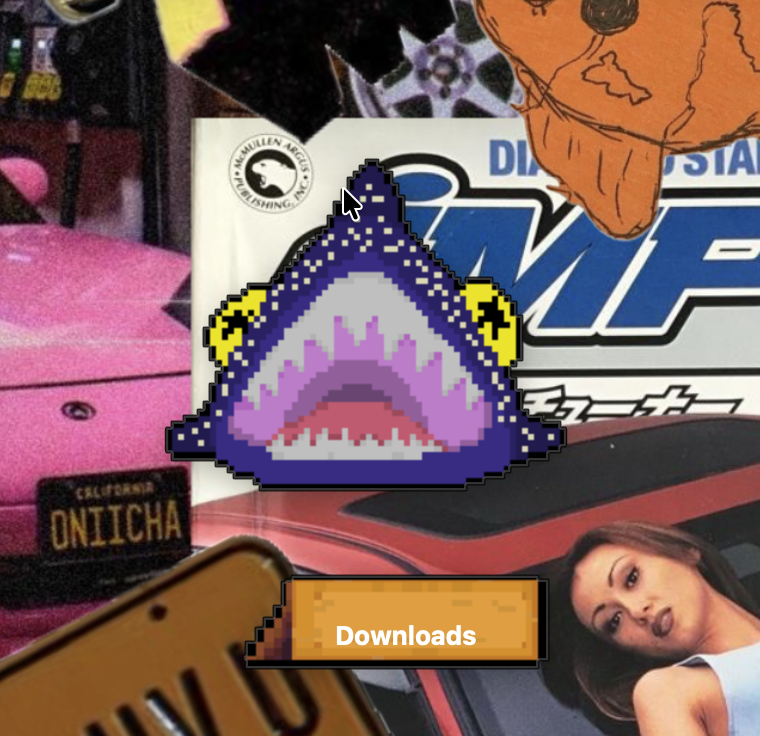

# DesktopShark 🦈
DesktopShark is a desktop pet built with Python and PySide6 that organizes files by "eating" them.

Drag files into the shark's mouth and they will be routed to the currently selected destination.

## Features
- Drag-and-drop file routing
- Multiple routing modes
- Trash support
- Persistent settings
- Draggable desktop pet
- Pixel-art sprites and UI

## Built With
- Python
- PySide6
- send2trash

## Configuration

DesktopShark uses the `MODES` list in `main.py` to determine where files are routed.

Example:

```python
MODES = [
    {
        "name": "Projects",
        "destination": "/Users/yourname/Documents/Projects"
    }
]
```

Replace the placeholder paths with folders that exist on your computer.

## Future Plans
- Additional shark skins
- More routing destinations
- Swimming animations
- Customizable nameplates

## Screenshots

### Main Interface


### Swim sprite
